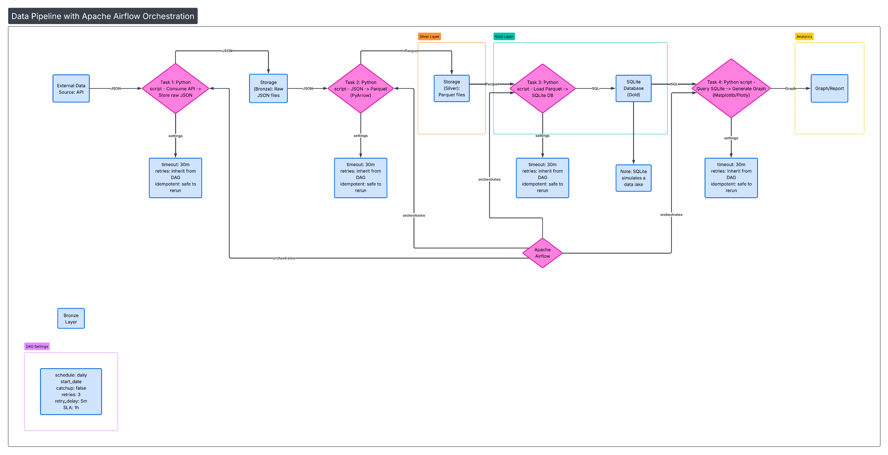
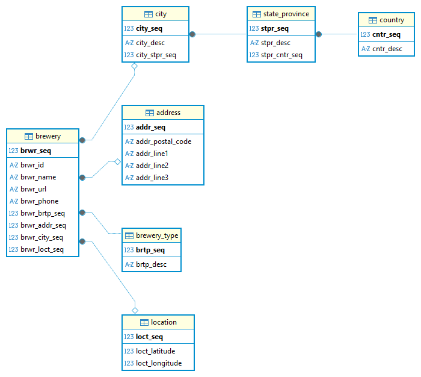
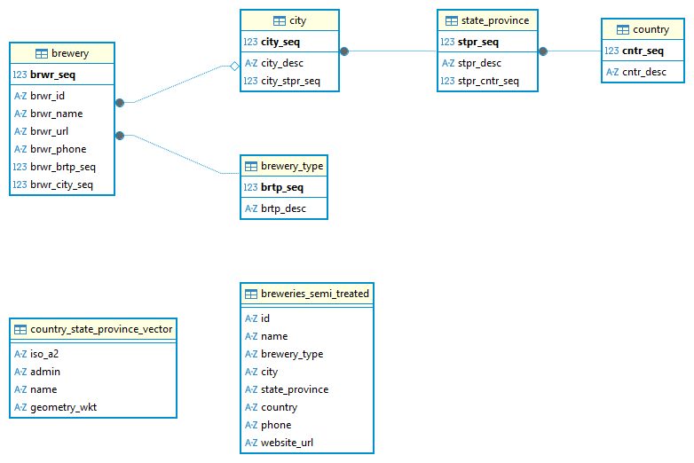

# breweries-case repo
Breweries Case of Data Engineering. This repo concerns to a sample case data engineering data extraction according to instructions and context below.

### Menu

*   [Context](#context)
*   [Instructions](#instructions)
*   [Hardware Informations](#hardware-information)
*   [Software Information](#tools-version)
    *   [Python Dependencies](#python-dependencies)
*   [Problem Solving](#problem-solving) 
    * [Architecture Proposed](#0-architecture) 
    * [Operational Boundaries](#disclaimer-about-operational-limits) 
        * [Bronze Layer](#bronze-layer) 
        * [Silver Layer](#silver-layer) 
        * [Gold Layer](#gold-layer) 
    * [Ploting Data Found](#silver-layer) 
## Context

You work as a Data Engineer at a large brewing company, and your mission is to build a
resilient and scalable Data Lake from scratch. To accomplish this, you will consume
data from the Open Brewery DB API, which provides information about breweries and pubs
around the world.

## Instructions

0. Architecture: Describe how you would design the data architecture. Provide a
blueprint or documentation that represents your proposed solution and explains
the main components and data flow.
0. Data Lake Architecture: Your data lake must follow the medallion architecture
having a bronze, silver, and gold layer:
    * Bronze Layer: Persist the raw data from the API in its native format or any
format you find suitable.
    * Silver Layer: Transform the data to a columnar storage format such as
parquet or delta, and partition it by brewery location. Please explain any
other transformations you perform.
    * Gold Layer: Create an aggregated view with the quantity of breweries per
type and location.

0. Language: Use the language of your preference for the requests and data
transformation. Please include test cases for your code. Python and PySpark are
preferred.
0. Orchestration Tool: To monitor your pipelines and schedule executions
continuously choose the orchestration tool of your preference (Airflow, Luigi, Mage
etc.) to build a data pipeline. We're interested in seeing your ability to handle
scheduling, retries, and error handling in the pipeline.
0. Data Quality: Describe how you would design and implement data quality checks,
detailing the techniques or rules you would apply and what dimensions of data
quality these checks would help ensure.
0. Observability / Alerts: Describe how you would design monitoring and alerting
mechanisms to ensure pipeline reliability — including how you would track pipeline
performance, detect and diagnose failures, and notify the appropriate stakeholders
when incidents occur.

## Enviroment Information

Due the lack of hardware resources the explanation will be mainly theorical. The code will try to example the proposition in scale.

### Hardware information
| Column                                                | Value                                                                                        |
|-------------------------------------------------------|----------------------------------------------------------------------------------------------|
| OS Name                                               | Microsoft Windows 10 Home                                                                    |
| Version                                               | 10.0.19045 Build 19045                                                                       |
| Other OS Description                                  | Not available                                                                                |
| OS Manufacturer                                       | Microsoft Corporation                                                                        |
| System Name                                           | HP                                                                                           |
| System Manufacturer                                   | HP                                                                                           |
| System Model                                          | HP Notebook                                                                                  |
| System Type                                           | x64-based PC                                                                                 |
| System SKU                                            | X7T74UAR#ABA                                                                                 |
| Processor                                             | AMD A10-9600P RADEON R5, 10 COMPUTE CORES 4C+6G, 2400 Mhz, 4 Core(s), 4 Logical Processor(s) |
| BIOS Version/Date                                     | Insyde F.24, 07/06/2017                                                                      |
| SMBIOS Version                                        | 2.8                                                                                          |
| Embedded Controller Version                           | 67.40                                                                                        |
| BIOS Mode                                             | UEFI                                                                                         |
| BaseBoard Manufacturer                                | HP                                                                                           |
| BaseBoard Product                                     | 81F9                                                                                         |
| BaseBoard Version                                     | 67.40                                                                                        |
| Platform Role                                         | Mobile                                                                                       |
| Secure Boot State                                     | Enabled                                                                                      |
| PCR7 Configuration                                    | Elevation Required for View                                                                  |
| Windows Directory                                     | C:\Windows                                                                                   |
| System Directory                                      | C:\Windows\system32                                                                          |
| Boot Device                                           | \Device\HarddiskVolume1                                                                      |
| Locale                                                | Brazil                                                                                       |
| Hardware Abstraction Layer                            | Version = "10.0.19041.6456"                                                                  |
| User Name                                             | HP\Pedro                                                                                     |
| Time Zone                                             | E. South America Standard Time                                                               |
| Installed Physical Memory (RAM)                       | 16.0 GB                                                                                      |
| Total Physical Memory                                 | 15.0 GB                                                                                      |
| Available Physical Memory                             | 7.24 GB                                                                                      |
| Total Virtual Memory                                  | 17.2 GB                                                                                      |
| Available Virtual Memory                              | 8.53 GB                                                                                      |
| Page File Space                                       | 2.25 GB                                                                                      |
| Page File                                             | C:\pagefile.sys                                                                              |
| Kernel DMA Protection                                 | Disabled                                                                                     |
| Virtualization-based Security                         | Not enabled                                                                                  |
| Device Encryption Support                             | Elevation Required for View                                                                  |
| Hyper-V - VM Monitor Mode Extensions                  | Yes                                                                                          |
| Hyper-V - Second Level Address Translation Extensions | Yes                                                                                          |
| Hyper-V - Virtualization Enabled in Firmware          | No                                                                                           |
| Hyper-V - Data Execution Protection                   | Yes                                                                                          |

### Tools version 

 python -m pipreqs.pipreqs "C:\Users\Pedro\Documents\breweries-case\"


| Software | Version |
|----------|---------|
| Python   | 3.13.12 |

#### Python dependencies

Read [requirements.txt](requirements.txt)

# Problem Solving


On these part I will describe the architecture I would use for these case. I will link to each python file simulating the steps of pipeline and explain tools to be used.

### Disclaimer: about operational limits


First of all I must set the boundaries I'm visualizing for this case. They are:

* Data, for this context, does not demand real time data acquisition. 
* The origin of data makes clear structure of response (JSON with defined keys)

Regarding that I'm not considering any tool like Apache kafka (if stream) or RabbitMq (for atomic data) data realtime handling.

## 0. Architecture



* For orchestration I would use apache airflow due to several features for scheduling running, workflows controls and native suport for python.
* The SQLite db was used to simulate a datalake like database.Usually I use Postregres as default, but my device have storage an processing capacity limitations.

Depending the infraestructure, scalability and availability the database suggestion could change. For general purpouses I usually
recommend Postgres due to a strong support community, it`s an open source tool (reduce costs of licensing or subscriptions) and have multiple plug-ins to help handling some commom problems of database, such as time series.

## 1. 


Considering the documentation available about the [https://www.openbrewerydb.org/documentation](https://www.openbrewerydb.org/documentation) :

| Field          | Type           | Description                                       |
|----------------|----------------|---------------------------------------------------|
| id             | string         | Unique identifier for the brewery                 |
| name           | string         | Brewery name                                      |
| brewery_type   | string         | Type of brewery (see by_type for possible values) |
| address_1      | string or null | Primary street address                            |
| address_2      | string or null | Secondary address line                            |
| address_3      | string or null | Third address line                                |
| city           | string         | City name                                         |
| state_province | string         | State or province                                 |
| postal_code    | string         | Postal or ZIP code                                |
| country        | string         | Country name                                      |
| longitude      | number or null | Longitude coordinate                              |
| latitude       | number or null | Latitude coordinate                               |
| phone          | string or null | Contact phone number                              |
| website_url    | string or null | Brewery website URL                               |
| state          | string         | State abbreviation or name (deprecated)           |
| street         | string or null | Street address (deprecated)                       |


## Medalion Layers

### Bronze Layer

Ingest data using python script to gether information in raw version. Save hole data in json file (depending on size of source is preferbly to input data on a noSQL database do garanty minimum loss in ocasional failure of execution)

The script of this step is available in [scripts\api_extration.py](scripts\api_extration.py)

### Silver Layer

Reading the API documentation I found that the street and state are deprecated. So I will drop those columns to clean data.

Regarding data quality, my approach to validation and data integrity is stablishing an Relational Database with a clear relationship diagram to keep info clustered and optimized for storage. Information that maybe not available will be kept into specific tables to avoid empty fields.

The original purspose was the below diagram.


A preliminar analisys if data from API showed that informations from City, State_province and country seems to be not null (no null values returned). So, to reflects that structure I modeled the relationship diagra considering normalization rules. However, also based in the preliminar analysis, I concluded that neither address or location coordinates were usefull meanfull information to be extracted to golden layer due to lack of structed information and the gaps of data could not be filled (e.g. filling location coordinates with zero indicates that the breweries without that information are placed somewhere in the Atlantic Ocean, near african coast) and country/state_province/city coluns are already providing enough data for location.

The table scheme, data integrity ingestion and validation, and python file to run the treatment are
* [scripts\treating_data.py](scripts\treating_data.py)
* [scripts\database_scheme.sql](scripts\database_scheme.sql)
* [scripts\database_integrity.sql](scripts\database_integrity.sql)



This is the final diagram for silver layer

### Gold Layer

On Database, we create a calculation table with aggregation data grouping by
* Country
* state_province
* brewery type
* geometry_wkt (for ploting assistance)
* n_of_breweries

````
CREATE TABLE aggr_brewery_by_country_state_brewry_type (
	country text NOT NULL,
	state_province text NOT NULL
	brewery_type TEXT NOT NULL,
	n_of_breweries INTEGER DEFAULT (0) NOT NULL
);

CREATE TABLE aggr_brewery_by_country_brewry_type (
	country text NOT NULL,
	state_province text NOT NULL
	brewery_type TEXT NOT NULL,
	n_of_breweries INTEGER DEFAULT (0) NOT NULL
);
````